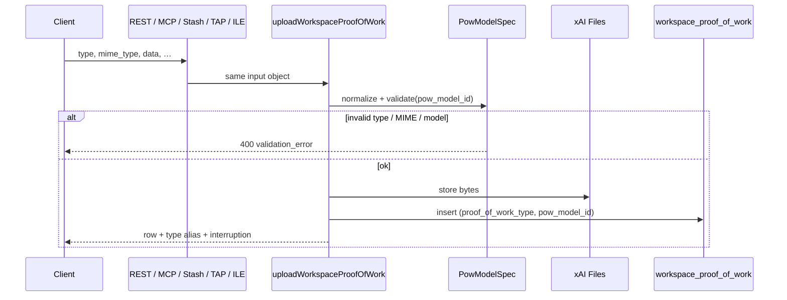
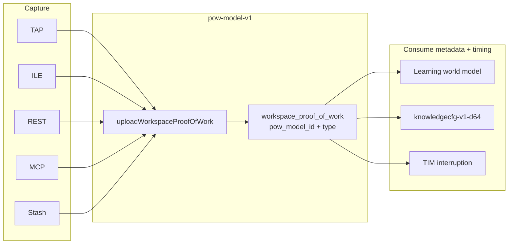
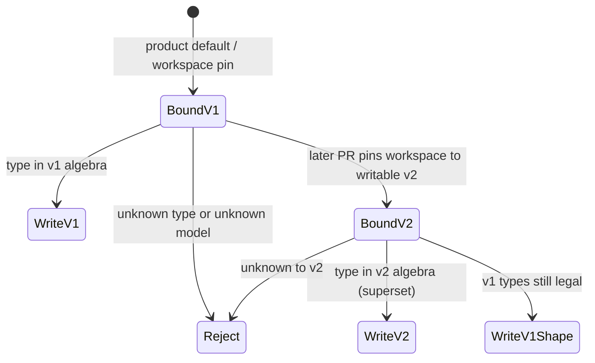

# Proof-of-Work Model v1 (`pow-model-v1`)

| | |
|---|---|
| **Status** | Draft |
| **Author** | Uncertain Systems |
| **Date** | 2026-08-26 |
| **Audience** | Senior engineers; product-page source of truth |
| **Scope** | Canonical evidence model + versioning so v2 can ship later |

---

## Overview

PoW is **evidence of process**, not a score. The stored type set is already `tool | screen | video | eeg`, but the *model* is unnamed: TAP traces skip the persist helper, ILE omits `video`, tests invent `speech`, schema/`spec_version` is confused with the evidence contract, and geometry silently bins unknown types as `other`.

This document freezes that contract as **`pow-model-v1`**, funnels every durable write through `uploadWorkspaceProofOfWork`, and versions the model so `pow-model-v2` can add types or encoding rules without rewriting persist or breaking v1 clients.

---

## Design Principles

Quote these. They are the product contract.

1. **Proof of work is evidence of process, not a score.** Sessions produce artifacts; LWM Snapshot is a separate, conscious trigger.
2. **Workspaces never close.** PoW accumulates for the life of the workspace.
3. **The PoW API is the primary workspace interface.** TAP, ILE, Stash, MCP, and REST are capture surfaces over one model.
4. **Capture ≠ score.** Ending a TAP/ILE session must not auto-run LWM Snapshot.
5. **Timing is checkpoint-agnostic.** Every event carries `timestamp_ms`; gaps, idle, and dwell are signal.
6. **Scope is block or workspace**, never implied by session end.
7. **Tool usage is the core stored signal.** Screen, video, and EEG enrich it.
8. **v1 stores exactly four modalities:** `tool`, `screen`, `video`, `eeg`.
9. **Thought traces are a kind of `tool`**, distinguished by `tool_name` / metadata — not a fifth CHECK value.
10. **Speech is a capture channel**, serialized into `tool` (transcript / thought-trace). It is not a stored type.
11. **More PoW improves evaluation.** Integrators re-fetch the live spec and regenerate skill.md.
12. **Downstream products consume metadata and timing, not raw bytes.** LWM, knowledge config, and TIM never require file payloads at encode time.
13. **One persist path:** `uploadWorkspaceProofOfWork`. No product-path direct table inserts.
14. **The evidence model is versioned** (`pow_model_id = pow-model-v1`). That is not `spec_version` (`1.3` / `1.5-opaque`) and not `embedding_model_id` (`knowledgecfg-v1-d64`).
15. **Unknown-to-this-version is explicit.** Never coerce a type to `other`. Reject on write; on read, count it in the existing dim-28 slot (`unknown_to_model`).

---

## Background & Motivation

### What is already true

| Layer | Canonical set | Location |
|---|---|---|
| TS enum | `tool \| screen \| video \| eeg` | `WORKSPACE_PROOF_OF_WORK_TYPES` in `lib/pow-api/workspace-proof-of-work.ts` |
| DB | same | `workspace_evidence_evidence_type_check` on `workspace_proof_of_work` |
| Schema gen | same | `recommended_proof_of_work_type` enum in `lib/pow-api/proof-of-work-schema.ts` |
| Aliases | `screenshot` / `screenshots` → `screen` | `TYPE_ALIASES`; anything else → `null` (reject) |
| Durable write | `uploadWorkspaceProofOfWork` | REST v3, MCP, Stash flush, ILE session, ILE speech/idle, TAP complete/speech/chat/idle |

Ontology already states principles 1–7, 11 (`lib/prompt-kernel/ontology.ts`, `lib/pow-api/integration-skill.ts`). They are not written down as one model.

### Drift this design resolves

| Drift | Reality | v1 rule |
|---|---|---|
| TAP traces bypass persist | `app/api/workspace-tap-score/trace/route.ts` is the remaining product `.insert`; siblings already use the helper | Copy speech/chat/idle template; usage + org collection apply; opaque lint stays off |
| Thought as fifth type | Stored as `tool` with reserved `tool_name`s | Keep as `tool`; detector ≠ write-path flags |
| ILE type fork | Client union is `tool \| screen \| eeg` | Capture **subset**, not a second algebra |
| ILE EEG columns dropped | Client sends `band_powers` / `device_name` / `sample_count`; `app/api/workspace/proof-of-work/route.ts` never reads them | Forward those fields (same as REST v3) |
| Unofficial `speech` | Tests/synthetics; encoder dim 28 `other` | Invalid stored type. Write already rejects; rename dim 28 |
| Schema vs wire | Spec `common_fields` lists `proof_of_work_type`; body uses `type` | Wire = `type`; DB = `proof_of_work_type` |
| Three “versions” | Semantic spec `1.3`, opaque `1.5-opaque`, MCP server `1.3.0` | None of these is the evidence model |
| MCP thinner than REST | Schema **and** `dispatch.ts` omit EEG/chunk fields; JSON-RPC HTTP 200 vs REST 201 | Same input object; HTTP 200 is JSON-RPC |
| Geometry `other` | Dim 28 = `typeCounts.other / denom` | Rename slot to `unknown_to_model`; do not add a dim |
| LWM appetite unconstrained | `want_more` / `preferred_modalities` are free strings | Vocabulary = `tool\|screen\|video\|eeg\|thought` |
| Leftover | `AnalysisInput` + `AudioInput` / `ImageInput` / `TextInput` in `lib/pow-api/types.ts` | Delete all four (unused) |

---

## Goals & Non-Goals

**Goals**

- Name today’s contract `pow-model-v1`. Stamp `pow_model_id` on every persisted row in PR 1; expose it on schema/stash/MCP/encoder in later PRs of this sequence.
- One persist pipeline: normalize → validate(model) → store.
- Versioning scaffolding so v2 can add types / MIME / thought-trace rules / geometry inputs without rewriting persist.
- Clean v1 drift in the same PR sequence as versioning — not “cleanup then maybe version.”

**Non-goals**

- Implementing `pow-model-v2`.
- Changing LWM Snapshot / GHC / TIM contracts.
- Making knowledge-config consume raw xAI bytes.
- Dual-writing two PoW rows per event.
- Forcing MCP JSON-RPC to HTTP 201.
- Teaching ILE to capture video.
- Moving `knowledgecfg-v1-d64` (no new dims; no TAP/ILE `system` flags on new writes).

---

## Proposed Design

### Three version axes (do not collapse)

| Axis | Identifier | What it versions | Today |
|---|---|---|---|
| **PoW model** | `pow_model_id` | Stored types, aliases, MIME, thought/speech encoding, persist rules | **`pow-model-v1`** (new) |
| **Spec** | `spec_version` | Generated JSON Schema / skill snapshot for integrators | `1.3` semantic (`EVIDENCE_SPEC_VERSION`); `1.5-opaque` |
| **Geometry** | `embedding_model_id` | Fixed-D learner embedding | `knowledgecfg-v1-d64` (+ experimental dual-writes on score) |

A v2 PoW model may ship while spec stays `1.3` and geometry stays `knowledgecfg-v1-d64`. The reverse is already true (geometry v2 dual-writes without a new PoW type).

### Canonical type algebra (`pow-model-v1`)

| Kind | Wire `type` | Stored `proof_of_work_type` | Aliases | MIME allowlist | Size |
|---|---|---|---|---|---|
| Stored | `tool` | `tool` | — | `application/json`, `text/plain`, `text/markdown`, `text/x-markdown` | ≤ 10 MB |
| Stored | `screen` | `screen` | `screenshot`, `screenshots` | `image/png`, `image/jpeg`, `image/jpg`, `image/webp` | ≤ 10 MB |
| Stored | `video` | `video` | — | `video/mp4`, `video/webm`, `video/quicktime` | ≤ 10 MB |
| Stored | `eeg` | `eeg` | — | `application/json`, `text/plain` | ≤ 10 MB |
| Encoding | *(thought)* | `tool` | — | tool MIME | `tool_name` + metadata; not CHECK |
| Encoding | *(speech)* | `tool` | — | tool MIME | Capture channel; not CHECK |
| Invalid | anything else | **reject** | — | — | Never persist; dim 28 on read |

Product clients may emit a **subset** (ILE today: tool/screen/eeg). They must import types from the model module, not fork the enum.

### Persist contract

```
normalize type (aliases) → validate against bound PowModelSpec (type + MIME only)
  → opaque lint if workspace.evaluation_mode is loaded
  → usage gate → xAI file upload
  → insertWorkspaceProofOfWorkRow (stamps pow_model_id)
```

Only `uploadWorkspaceProofOfWork` may run that sequence on the product path.

**Allowed exceptions (not product capture):**

- Demo seed SQL (`scripts/seed-*-demo-workspace.ts`) — no xAI; column DEFAULT covers `pow_model_id` if omitted.
- Data Studio PATCH/invalidate — metadata-only; cannot set `proof_of_work_type` or `pow_model_id`.



#### TAP cutover

**Decision:** copy TAP `speech` / `chat` / `idle` — helper + `authContextFromTapAccess(access, "tap-trace")` + workspace select `id, user_id, organization_id` only. Do **not** load `evaluation_mode`.

| Effect | After PR 2 |
|---|---|
| Usage (`assertCanSubmitProofOfWork`) | applies (402 on limited plans is intended; TAP traces count like ILE) |
| Org xAI collection | applies when `organization_id` is present |
| Opaque lint / metadata sanitize | **off** — same as TAP siblings today. Loading `evaluation_mode` would strip `tap_session_id` (`fetchTapSessionTraces`) and 400 payloads that mention `foo.json` |
| TAP `complete` | already on the helper; CI grep fails only on `trace/route.ts` |

### Thought-trace rule

Thought is **not** a stored type. **Write-path convention ≠ read-path detector.** Encoding names are not CHECK-enforced.

**New writes (do not add TAPBench-only flags to TAP/ILE — that would move dim 26):**

| Surface | `tool_name` | `tool_action` | Metadata |
|---|---|---|---|
| Human TAP | `tap-thought-trace` | `{system1\|system2}:{action}` | `trace_type`, `action`, ids, `text` — **no** `system` / `selective_thought` |
| ILE | `ile-thought-trace` | same | same as TAP |
| TAPBench / Stash | `stash_submit_api` | same | already sets `selective_thought`, `thought_trace`, `system`, `system_n`, `trace_type` — leave as-is |

Payload MIME `application/json`; payload `type` is `uncertain_systems_tap_thought_trace` or `uncertain_systems_ile_thought_trace`.

**Detector (existing rows)** — same function in `encoder.ts` and `experimental-encoders.ts`:

```
isThoughtTrace(row) iff
  tool_name ∈ {tap-thought-trace, ile-thought-trace, stash_submit_api}
  OR metadata.selective_thought === true
  OR metadata.thought_trace === true
  OR metadata.trace_type ∈ {system1, system2}
```

Drop `name.includes("speech")` and `source` regex. Speech tool names are not thought. TAP/ILE keep counting via reserved `tool_name` + `trace_type`. `system1Share` (dim 26) stays TAPBench-only until an embedding bump.

### Speech rule

Speech is a **microphone channel**, not a CHECK value. `type: "speech"` is already rejected on write (`normalizeProofOfWorkType` → `null` + DB CHECK).

| Capture | Stored as | `tool_name` | Notes |
|---|---|---|---|
| ILE start/stop | `tool` | `ile-speech-segment` | already via helper |
| TAP start/stop | `tool` | `tap-speech-segment` | `lib/tap-speech-proof-of-work.ts`; already via helper |
| TAP session complete | `tool` | `tap-transcript` | End-of-session blob — **not** a speech segment |
| Selective thought from speech | `tool` | `tap-thought-trace` / `ile-thought-trace` | thought-trace write path |
| Unofficial `type: "speech"` | **reject** | — | Encoder dim 28 until tests drop it (PR 3b) |

Audio bytes are not a v1 stored modality. A future audio type is `pow-model-v2`.

### Geometry inputs

`knowledgecfg-v1-d64` reads **aggregates + symbolic tokens**, not xAI file bytes.

| Used | Not used (v1) |
|---|---|
| Type mix, `timestamp_ms` gaps/burst/idle | Raw payload as primary axes (experimental content models only) |
| `tool_name` / `tool_action` diversity | File bytes |
| Thought-trace fraction (detector above) | Invented stored types |
| `block_id`, `device_name` / EEG presence, `sample_count` | `AnalysisInput` |

**Dim 28:** keep the slot. Rename `typeCounts.other` → `unknown_to_model`. Same formula: `proof_of_work_type ∉ {tool,screen,video,eeg}`. After PR 4, also if `row.pow_model_id` is newer than the encoder view. Mirror in `experimental-encoders.ts` in the **same PR** as the v1 encoder rename. Do not add a dim. Do not bump `knowledgecfg-v1-d64`. Fixture `"speech"` rows still land in dim 28 until PR 3b.

**Appetite vocabulary (decided):** `tool | screen | video | eeg | thought`. `thought` means more thought-trace `tool` rows. Never persist `speech` as `proof_of_work_type`.

Experimental geometry dual-writes on score remain an **embedding** concern, not a PoW-row analog.



---

## Versioning

### Registry (learn from knowledge-config; do not copy blindly)

Knowledge-config: same PoW rows → many embeddings (`dualWriteOnScore`).  
PoW model: **one row per event**, one `pow_model_id`. Dual-writing two artifacts of the same event is wrong.

```ts
export const POW_MODEL_V1_ID = "pow-model-v1" as const;

export interface PowModelSpec {
  id: string;
  storedTypes: readonly string[];
  aliases: Readonly<Record<string, string>>;
  mimeByType: Readonly<Record<string, ReadonlySet<string>>>;
  /** Write-path / detector constants — not CHECK. */
  thoughtTraceToolNames: readonly string[];
  speechToolNames: readonly string[]; // ile-speech-segment, tap-speech-segment
  maxBytes: number;
  isProductDefault: boolean;
  writable: boolean; // v1 true; future ids false until their PR
}

export function validatePowAgainstModel(spec: PowModelSpec, input: { type: string; mime_type: string }):
  | { ok: true; storedType: string }
  | { ok: false; code: "unknown_type" | "unknown_model" | "mime_not_allowed" };
```

`validatePowAgainstModel` is **type + MIME only**. Thought/speech names are conventions consumed by detectors and writers, not by this validator. Existing `normalizeProofOfWorkType` / `isAllowedProofOfWorkMime` wrap the default spec.

New module: `lib/pow-api/pow-model.ts`.

### Binding (write path stays v1 until a later PR opts in)

1. If request `pow_model_id` is present, it must equal the workspace pin (or product default if unpinned). Else **400**.
2. Else `workspaces.pow_model_id` (NULL → v1).
3. Else product default `pow-model-v1`.

Unknown id → **400**. Type not in bound spec → **400** `unknown_type`. Until v2 is `writable: true`, DB CHECK is `pow_model_id = 'pow-model-v1'`.

**Stash:** validate type/MIME at ingest against the bound spec; stamp `pow_model_id` at flush via the helper (not on the in-memory unit in PR 1).



### Compatibility

| Writer | Row `pow_model_id` | v1 reader / encoder | v2 reader (future) |
|---|---|---|---|
| v1 client, unpinned / pinned v1 | `pow-model-v1` | native | native (v1 subset) |
| v1 client sends v2-only type | rejected | — | — |
| v2 client, workspace pinned v2 | `pow-model-v2` | dim 28 for v2-only types; v1 types still counted | native |
| Mismatched request id vs pin | rejected | — | — |

**No row dual-write.** Existing v1 rows keep `pow-model-v1` if the workspace later pins v2. New writes follow the pin.

### How a v2 would land (sketch only)

1. Register `PowModelSpec` `{ id: "pow-model-v2", …, writable: true }`.
2. Widen CHECK to `(pow_model_id, proof_of_work_type)` pairs.
3. Allow pin / request onto v2 (default remains v1).
4. v1 encoder stays frozen: foreign types → dim 28.
5. Optional new geometry = `embedding_model_id` bump, not a silent change to `knowledgecfg-v1-d64`.

---

## API / Interface Changes

Wire field remains `type`. Responses keep `type` as an alias of `proof_of_work_type`. Optional request `pow_model_id` (default resolved). Every persisted row/response includes `pow_model_id` once the column exists.

| Field | REST v3 | MCP schema + dispatch today | ILE product route today | v1 target |
|---|---|---|---|---|
| `type`, `mime_type`, `data`, `block_id`, `session_id`, `file_name`, `tool_name`, `tool_action`, `metadata`, `timestamp_ms` | yes | yes | yes | yes |
| `band_powers`, `device_name`, `sample_count` | yes | **no** (schema *and* `dispatch.ts`) | client sends; **route drops** | **yes** on MCP helpers+dispatch **and** `app/api/workspace/proof-of-work/route.ts` |
| `chunk_index` | yes | **no** | no | MCP yes; ILE optional |
| `pow_model_id` | no | no | no | optional, default v1 |
| HTTP status | 201 | JSON-RPC **200** | 201 | keep transport difference |

Schema generator `common_fields` lists **`type`**, not `proof_of_work_type`. Spec JSON also returns `pow_model_id` beside `spec_version`.

**Catalog** (GET workspace, GET learning-progress, POST proof-of-work-schema):

```json
{
  "pow_model_id": "pow-model-v1",
  "writable_models": [
    { "id": "pow-model-v1", "storedTypes": ["tool", "screen", "video", "eeg"] }
  ]
}
```

**Pin:** same route and auth as today’s PATCH — `authenticateRequest(..., "workspaces:write")` + `canAccessAgentWorkspace` (owner `user_id`, guest owner `guest_user_id`, or matching `organization_id`; **not** org-admin-only). No pinning UI.

| Rule | Behavior |
|---|---|
| Body | Non-empty; at least one of `workspace_goal` \| `pow_model_id` |
| Update | Provided keys only — pinning must not null or rewrite `workspace_goal` |
| `pow_model_id` | Must be in `writable_models`; unknown or non-writable → **400** |
| Until v2 | only `pow-model-v1` is accepted |

ILE `UploadIleProofOfWorkInput.type` stays a capture subset; import `WorkspaceProofOfWorkType` from the model.

---

## Data Model Changes

```sql
-- PR 1
ALTER TABLE public.workspace_proof_of_work
  ADD COLUMN pow_model_id text NOT NULL DEFAULT 'pow-model-v1';
ALTER TABLE public.workspace_proof_of_work
  ADD CONSTRAINT workspace_proof_of_work_pow_model_id_check
  CHECK (pow_model_id = 'pow-model-v1');
-- Existing type CHECK stays: proof_of_work_type IN ('tool','screen','video','eeg')

-- PR 4
ALTER TABLE public.workspaces
  ADD COLUMN pow_model_id text; -- NULL = product default v1
```

**Backfill:** column DEFAULT. No xAI rewrite. Seeds may omit the column.

**Read path (PR 1):** `PROOF_OF_WORK_SELECT` adds `pow_model_id` **and** `band_powers` (row type already has `band_powers`; select currently omits it). `ADMIN_POW_SELECT` adds `pow_model_id` (already has `band_powers`).

**Data Studio (PR 4):** `buildStudioPowPatch` denylist includes `pow_model_id` and `proof_of_work_type`; tests cover it.

**v2 (later):** drop `pow_model_id = 'pow-model-v1'` CHECK; pair-constrain `(pow_model_id, proof_of_work_type)`.

---

## Alternatives Considered

| Alternative | Why not |
|---|---|
| **A. Freeze the type enum as the only identity** | Cannot add types or change thought-trace rules without breaking CHECK + clients. |
| **B. Dual-write every event into v1 and v2 rows** | Doubles storage and TIM noise. Geometry dual-write is the analog for *embeddings*, not evidence. |
| **C. Store thought / speech as fifth/sixth CHECK values** | Conflicts with frozen v1 algebra, existing rows, and TAP/ILE `tool_name`s. |
| **D. Reuse `spec_version` instead of `pow_model_id`** | `1.3` vs `1.5-opaque` vs MCP server `1.3.0` already collide; spec versions generated JSON, not the stored type algebra. |
| **E. Leave encoder dim 28 named `other` until first v2 write** | Acceptable deferral of PR 1 encoder churn, but unofficial `speech` fixtures already hit the slot. Renaming the accumulator (same formula, same dim) is cheaper than teaching implementers that `other` is a stored type. |

---

## Security & Privacy

| Threat | Mitigation |
|---|---|
| TAP bypass skips usage | Helper is the only insert path — TAP traces count; 402 on limited plans |
| Opaque TAP thought JSON | **Do not** load `evaluation_mode` on TAP product routes (sibling parity). Opaque lint stays off so `tap_session_id` and thought `text` survive |
| Client claims `pow_model_id=v2` | Unknown / non-writable → 400; DB CHECK v1-only |
| Retcon via Data Studio | PATCH denylist: `proof_of_work_type`, `pow_model_id` |
| Spec/model confusion | Validate against `PowModelSpec`, not `spec_version` |

Auth, guest vs owner `user_id`, and opaque allowlists on REST/MCP (non-TAP) are unchanged.

---

## Observability

Log / metric labels: `pow_model_id`, `proof_of_work_type`, `tool_name`, persist_path=`uploadWorkspaceProofOfWork`.

| Signal | Alert |
|---|---|
| Direct `.insert` outside helper + seeds | CI grep; after PR 2, only seeds should match |
| `unknown_type` / `unknown_model` 400 rate | Spike = client on wrong model |
| Rows with `pow_model_id` ≠ v1 while v2 unshipped | Impossible if CHECK holds |
| Dim 28 fraction | Expected ~0 in production until v2; non-zero in tests until PR 3b |

---

## Rollout Plan

1. Product default writable model = `pow-model-v1`. No pin required.
2. Column DEFAULT backfills identity with zero client change.
3. TAP `trace` cutover: usage + org collection; opaque lint **unchanged** (off).
4. MCP extra fields are additive; old clients omit them. ILE EEG fields start persisting (additive columns).
5. Negotiation ships with only v1 writable. Pin via existing workspace PATCH; no UI required.
6. Rollback: revert route/helper PRs independently. Do not drop `pow_model_id`.

---

## Risks

| Risk | Severity | Mitigation |
|---|---|---|
| TAP traces count against usage (high-frequency crystallize/send/edit) | Medium | Intended; ILE already counts. Paid `api_metered` / `trial` unlimited; `TOKEN_REGULAR_PROOF_OF_WORK_LIMIT = 25` and `inactive` are not. Document 402 in TAP PR |
| Tightening thought detector drops speech-as-thought | Low | Speech should not have been thought. Snapshot encoder fixtures in PR 3b |
| Adding `system` flags on TAP/ILE | High if done | **Do not** in this wave |
| Clients send `proof_of_work_type` in the body | Low | Accept as alias of `type` in the helper only |
| Seed scripts omit `pow_model_id` | Low | Column DEFAULT |
| Appetite still emits `speech` from Grok | Medium | Constrain prompt + post-filter (PR 3b) |

---

## Open Questions

None. Appetite vocabulary, TAPBench identity, TAP opaque policy, and pin-vs-request are Key Decisions.

---

## Key Decisions

1. **Model id is `pow-model-v1`.** Independent of `spec_version` and MCP server version.
2. **Four stored types; thought and speech encode as `tool`.** Matches DB CHECK and TAP/ILE `tool_name`s.
3. **One persist helper.** Remaining bypass is TAP `trace/route.ts`. Copy speech/chat/idle (`authContextFromTapAccess(access, "tap-trace")`, no `evaluation_mode`). Usage + org collection apply; **opaque lint does not**. TAP traces count as PoW submissions like ILE (402 is intended).
4. **One row per event, stamped with `pow_model_id`.** Do not dual-write PoW rows.
5. **Write default stays v1.** Request `pow_model_id` may only match the workspace pin (or omit). Unknown model/type → 400, never `other`.
6. **Geometry dim 28 is renamed `unknown_to_model`**, same formula, no new dim, no `knowledgecfg-v1-d64` bump. Encoder view vs `row.pow_model_id` is PR 4.
7. **Wire `type` / DB `proof_of_work_type`.** Schema follows the wire name.
8. **MCP helpers *and* dispatch** gain EEG/chunk fields; ILE product route forwards the EEG fields it already receives. HTTP 200 remains JSON-RPC.
9. **ILE missing `video` is a capture subset**, not a second type enum.
10. **Delete unused `AnalysisInput`, `AudioInput`, `ImageInput`, `TextInput`** in `lib/pow-api/types.ts` (`lib/xai-client.ts` has a different `ImageInput`).
11. **TAPBench identity stays `stash_submit_api`** vs human `tap-thought-trace`; same payload/metadata shape.
12. **TAP/ILE thought writes do not add `system` / `selective_thought`** in this wave (dim 26 freeze). Detector still counts them via `tool_name` + `trace_type`.
13. **Appetite vocabulary is `tool\|screen\|video\|eeg\|thought`.** Never persist `speech`.
14. **`validatePowAgainstModel` is type + MIME only.** Reserved thought/speech `tool_name`s are write-path conventions, not CHECK.
15. **Pin via `PATCH /api/v3/pow/workspaces/{id}`** with today’s auth (`canAccessAgentWorkspace` + `workspaces:write` — owner, guest owner, or org member; not org-admin-only). Partial update of provided keys; unknown / non-writable `pow_model_id` → 400. No UI in this wave.

---

## References

- `lib/pow-api/workspace-proof-of-work.ts` — types, aliases, MIME, `PROOF_OF_WORK_SELECT`
- `lib/pow-api/upload-workspace-proof-of-work.ts` — canonical persist
- `lib/pow-api/proof-of-work-schema.ts` / `proof-of-work-integration.ts` — `spec_version` `1.3`
- `lib/pow-api/opaque-evaluation.ts` — `spec_version` `1.5-opaque`
- `lib/pow-api/stash-api.ts` — buffer then flush via helper
- `lib/pow-api/mcp-tools/helpers.ts` + `dispatch.ts` — MCP upload
- `lib/admin/proof-of-work.ts` / `lib/pow-api/studio-pow-mutate.ts` — admin select / PATCH
- `lib/tap-score-session-auth.ts` — `authContextFromTapAccess`
- `lib/tap-speech-proof-of-work.ts` — `tap-speech-segment`
- `lib/ile-proof-of-work-client.ts` / `app/api/workspace/proof-of-work/route.ts` — ILE capture + product persist
- `app/api/workspace-tap-score/trace/route.ts` — remaining bypass
- `app/api/workspace-tap-score/{speech,chat,idle,complete}/route.ts` — persist template
- `app/api/v3/pow/workspaces/[id]/route.ts` — workspace PATCH (pin)
- `lib/knowledge-config/encoder.ts` / `registry.ts` / `experimental-encoders.ts`
- `supabase/migrations/20260711120000_baseline.sql` — type CHECK
- `docs/PROOF_OF_WORK_API.md`, `public/skill.md`

---

## PR Plan

Each PR is independently reviewable and mergeable. Versioning scaffolding is mixed with v1 drift cleanup. Encoder contract: PR 1 = dim 28 rename only; PR 3b = detector + appetite; PR 4 = branch on `row.pow_model_id` (same slot).

### PR 1 — Name `pow-model-v1` and stamp rows

- **Title:** `pow: export pow-model-v1 and stamp pow_model_id`
- **Depends on:** none
- **Files:** `lib/pow-api/pow-model.ts` (new), `lib/pow-api/workspace-proof-of-work.ts` (`PROOF_OF_WORK_SELECT` + `pow_model_id` + `band_powers`), `lib/pow-api/upload-workspace-proof-of-work.ts` (explicit stamp), `lib/admin/proof-of-work.ts` (`ADMIN_POW_SELECT`), `supabase/migrations/*_pow_model_id.sql`, `lib/knowledge-config/encoder.ts` + `experimental-encoders.ts` (rename dim-28 accumulator only), tests for normalize/validate
- **Changes:** Registry + `POW_MODEL_V1_ID`. Normalize/MIME wrap the v1 spec. NOT NULL DEFAULT + CHECK `pow_model_id = 'pow-model-v1'`. Helper stamps the id. Dim 28 renamed `unknown_to_model`, **same formula** (type ∉ stored types). `"speech"` fixtures still land there. No stash/MCP/schema work.

### PR 2 — Single persist path (TAP traces)

- **Title:** `pow: persist TAP thought-traces via uploadWorkspaceProofOfWork`
- **Depends on:** PR 1
- **Files:** `app/api/workspace-tap-score/trace/route.ts`, tests (`tests/lib/p1-p10-helpers.test.ts` and TAP trace tests), CI grep
- **Changes:** Copy `speech`/`chat`/`idle`: `authContextFromTapAccess(access, "tap-trace")`, workspace `id, user_id, organization_id`, helper with `type: "tool"`, `tool_name: tap-thought-trace`, existing metadata (`trace_type`, `action`, ids, `text`) — **do not** add `system` / `selective_thought`. Drop duplicate xAI+insert. Usage + org collection apply; opaque lint stays off. CI grep fails only on `trace/route.ts` until merged. Seeds keep SQL; DEFAULT covers `pow_model_id`.

### PR 3a — Align schema, skill, MCP, ILE, docs

- **Title:** `pow: align spec/MCP/ILE with pow-model-v1`
- **Depends on:** PR 1; parallel to PR 2
- **Files:** `lib/pow-api/proof-of-work-schema.ts`, `proof-of-work-integration.ts`, `opaque-evaluation.ts`, `mcp-tools/helpers.ts`, **`mcp-tools/dispatch.ts`**, `integration-skill.ts`, `lib/ile-proof-of-work-client.ts`, **`app/api/workspace/proof-of-work/route.ts`**, `lib/pow-api/types.ts` (delete `AnalysisInput` + `AudioInput` / `ImageInput` / `TextInput`), `docs/PROOF_OF_WORK_API.md`, `public/skill.md`
- **Changes:** Spec responses include `pow_model_id` distinct from `spec_version`. `common_fields` uses wire `type`. MCP schema **and** dispatch forward `band_powers`, `device_name`, `sample_count`, `chunk_index`, `pow_model_id`. ILE product route forwards EEG fields. ILE client imports model types (video unused is fine). Leftover analysis-input types removed. **No** encoder detector / appetite work.

### PR 3b — Thought detector + appetite vocabulary

- **Title:** `pow: thought-trace detector and appetite vocabulary`
- **Depends on:** PR 1 (dim 28 already renamed)
- **Files:** `lib/knowledge-config/encoder.ts`, `experimental-encoders.ts` (detector only), `lib/prompt-kernel/world-model.ts`, `lib/knowledge-config/synthetic-knowledge-region.ts`, `tests/lib/knowledge-distance.test.ts`, encoder fixtures
- **Changes:** Shared detector as specified (reserved names ∪ flags ∪ `trace_type`; drop speech substring). Appetite tokens filtered to `tool|screen|video|eeg|thought`. Synthetics/tests stop using `speech` as a stored type. Snapshot fixtures before/after. Dim 26 unchanged.

### PR 4 — Model-version negotiation (v2-ready, v1-only writable)

- **Title:** `pow: workspace/request pow_model_id negotiation`
- **Depends on:** PR 1; ideally 2–3a so every surface speaks the field
- **Files:** migration `workspaces.pow_model_id`; `upload-workspace-proof-of-work.ts`; `stash-api.ts` (ingest vs bound spec); MCP dispatch + REST v3 + session PoW routes; `app/api/v3/pow/workspaces/[id]/route.ts` (PATCH pin); learning-progress / schema catalog JSON; encoder branch on `row.pow_model_id` (dim 28, same slot); `lib/pow-api/studio-pow-mutate.ts` + data-studio tests (denylist); `lib/admin/proof-of-work.ts` if select not already updated
- **Changes:** Resolution order (request must match pin → pin → default v1). Catalog JSON as specified; only v1 `writable: true`. Unknown id or type-not-in-spec → 400. Stash validates at ingest, stamps at flush. PATCH keeps `canAccessAgentWorkspace` + `workspaces:write`; accepts `pow_model_id` as a partial update (do not touch omitted `workspace_goal`); unknown / non-writable id → 400; require a non-empty body. Data Studio cannot retcon. Default write path unchanged.

### PR 5 — (Later, out of scope) Introduce `pow-model-v2`

- **Title:** `pow: register pow-model-v2` *(not in this implementation wave)*
- **Depends on:** PR 4
- **Files:** `lib/pow-api/pow-model.ts` (new spec), CHECK pair constraint, optional encoder view, workspace pin allowlist
- **Changes:** Add types/MIME/thought rules as then-specified. Do not rewrite `uploadWorkspaceProofOfWork`. Do not bump `knowledgecfg-v1-d64`. v1 clients and v1 rows stay valid.

---

*End of draft.*
